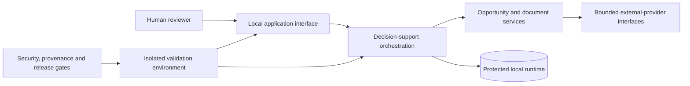

# Architecture Overview

This diagram is intentionally abstract. It communicates responsibility boundaries without exposing private endpoints, schemas, provider request construction, prompts, ranking logic, or defensive thresholds.

## Responsibility boundaries

- **Human reviewer:** retains control of consequential decisions and submission.
- **Local interface:** presents outcome, freshness, and review state without claiming unavailable work succeeded.
- **Decision-support orchestration:** coordinates bounded workflows while keeping provider failures explicit.
- **Services:** separate opportunity handling, document preparation, and validation concerns.
- **External-provider interfaces:** are constrained integration boundaries; implementation details are private.
- **Protected local runtime:** owns mutable user state and is never used as disposable test storage.
- **Validation environment:** uses separate temporary state and a separate local test endpoint.
- **Release gates:** cover tests, dependency risk, secrets, privacy, IP provenance, and human control.

## Deliberate abstraction

This overview omits production source, database layout, endpoint maps, provider adapters, internal prompts, exact scoring or deduplication logic, security thresholds, and deployment details. Those omissions prevent material reconstruction while preserving the architectural reasoning a reviewer needs to assess.
